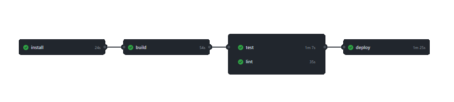

  

Demo: https://sanchis.github.io/DevAway-Racing-Services-angular/

# Devaway-Racing-Services

Project related to a technical interview on [devaway.io]('https://devaway.io/').
Show the list of pilots with their times.

- Global ranking of pilots.
- List of drivers.
- Result of each race per driver.  
  This project was generated with [Angular CLI](https://github.com/angular/angular-cli) version 11.1.2.

# Getting Started

## Prerequisites

- Node 12+

## Development server

Before run the app install all dependencies.
`npm i`.  
Run `ng serve` for a dev server. Navigate to `http://localhost:4200/`. The app will automatically reload if you change any of the source files.

## Code scaffolding

Run `ng generate component component-name` to generate a new component. You can also use `ng generate directive|pipe|service|class|guard|interface|enum|module`.

## Build

Run `ng build` to build the project. The build artifacts will be stored in the `dist/` directory. Use the `--prod` or `npm run build:prod` flag for a production build.

## Running unit tests

Run `ng test` to execute the unit tests via [Karma](https://karma-runner.github.io).

## Further help

To get more help on the Angular CLI use `ng help` or go check out the [Angular CLI Overview and Command Reference](https://angular.io/cli) page.

# CI and CD

